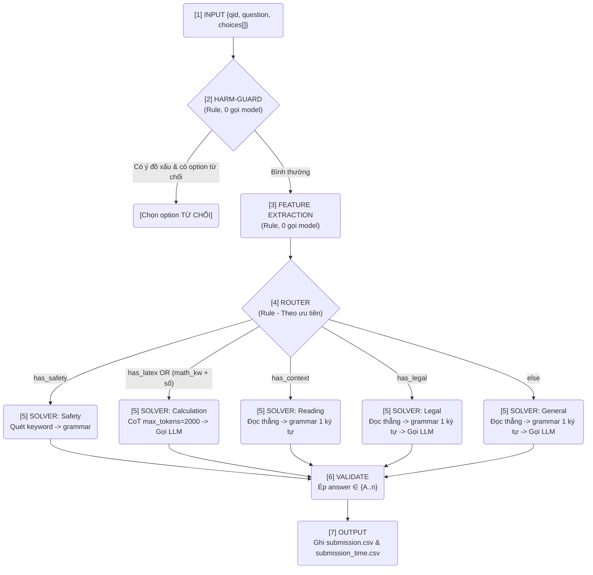

# HackAIthon 2026 — Bảng C — Giải trắc nghiệm tiếng Việt (Qwen3.5-4B)

Pipeline giải câu hỏi trắc nghiệm (MCQ) tiếng Việt bằng LLM **Qwen3.5-4B** (GGUF Q8_0). Hệ thống chạy qua `llama-cpp-python` (gọi hàm in-process, **KHÔNG** qua server/port/API ngoài). Model có kích thước ≤ 5B tham số, tuân thủ tuyệt đối giới hạn của thể lệ Bảng C.

## 🌟 Điểm nổi bật
- **Entry-point**: `predict.py` (thực thi qua script `inference.sh`).
- **Đầu vào**: Đọc dữ liệu từ `/code/private_test.json` (thư mục BTC mount vào khi chấm).
- **Đầu ra**: Ghi kết quả `submission.csv` (qid, answer) và `submission_time.csv` (qid, answer, time) trực tiếp vào `/code`.
- **Độc lập & Tối ưu**: Sử dụng một model LLM duy nhất, không dùng embedding/RAG, không yêu cầu kết nối internet lúc suy luận (inference).

---

## 🚀 Hướng dẫn chạy (Chuẩn quy trình chấm của BTC)

> **Lưu ý**: Image sử dụng CUDA nên yêu cầu máy tính có GPU NVIDIA và đã cài đặt Docker (NVIDIA Container Toolkit). Cần khoảng **5GB VRAM trống** (model 4B Q8 chiếm ~4.3GB). Lần đầu chạy cần internet để pull image, các lần sau hoàn toàn có thể chạy offline.

### Bước 1: Pull image từ Docker Hub
```bash
docker pull karuizawa/hackaithon-bangc:final
```

### Bước 2: Chạy & Mount thư mục dữ liệu
Đặt file `private_test.json` vào một thư mục trên máy (ví dụ `./data`), sau đó chạy lệnh:
```bash
docker run --gpus all -v /đường_dẫn/tới/thư_mục_data:/code karuizawa/hackaithon-bangc:final
```
*Container sẽ tự động thực thi `inference.sh` → `predict.py`: đọc dữ liệu `/code/private_test.json`, giải quyết từng câu hỏi và ghi kết quả trở lại `/code`.*

### Bước 3: Nhận kết quả
Hai file sẽ được tạo ra ngay trong thư mục bạn đã mount:
- `submission.csv`: Chứa thông tin kết quả dưới dạng `qid, answer`.
- `submission_time.csv`: Chứa thông tin `qid, answer, time` (thời gian inference của từng câu - tính bằng giây).

**Dấu hiệu chạy thành công**: 
- Trong log hiển thị `[predict] model=Qwen3.5-4B-Q8_0.gguf | n_gpu_layers=-1 (gpu=True...)` (hệ thống đã nhận diện được GPU).
- Log kết thúc bằng dòng `[predict] XONG (... câu ...)`. 
- Tốc độ tham khảo: **~4–6 giây/câu** (được đo đạc trên card đồ họa RTX 4060 8GB).

---

## 📊 Pipeline Flow — Sơ đồ xử lý 1 câu hỏi



### 🎯 Kỹ thuật "Grammar ép 1 ký tự" (GBNF)
Thay vì để LLM tự do sinh văn bản rồi dùng Regex trích xuất, hệ thống áp dụng kỹ thuật ép LLM **CHỈ xuất đúng 1 chữ cái hợp lệ**:
```text
root ::= [A-D]  # VD: câu có 4 lựa chọn, LLM buộc phải trả về A hoặc B hoặc C hoặc D
```
*Lợi ích*: Không sinh rác, độ trễ sinh text cực thấp (chỉ mất 1 token), độ chính xác tuyệt đối trong khâu trích xuất đáp án. Nhãn đáp án (A-K) có thể tự động co giãn theo số lượng lựa chọn của đề.

---

## 🗂️ Xử lý dữ liệu (Data Processing)

- **Đọc đề (`src/io_utils.py`)**: Nạp `private_test.json` (hỗ trợ cả định dạng `.csv`). Quản lý mảng `choices[]` linh hoạt từ A đến K (không hard-code 4 đáp án cố định).
- **Tách ngữ cảnh (`src/features.py`)**: Phát hiện các đoạn văn bản dài (đặc trưng của dạng câu hỏi đọc hiểu) để tách biệt với câu hỏi chính.
- **Trích đặc trưng & Định tuyến**: Nhận diện các từ khóa đặc biệt (LaTeX/Toán, Pháp luật, An toàn, Có ngữ cảnh) để điều hướng vào 1 trong 5 nhánh xử lý. Toàn bộ khâu này chạy 100% bằng Rule, giúp không tốn bất kỳ lượt gọi Model LLM nào.
- **Trích đáp án (`src/extract.py`)**: Xử lý output nhiều tầng, ưu tiên format `"Đáp án: X"`, sau đó là chữ cái đứng riêng lẻ, và cuối cùng fallback về grammar 1 token.
- **Đo thời gian (`predict.py`)**: Tính toán `end - start` cho từng câu và lưu vào `submission_time.csv` tuân thủ nghiêm ngặt yêu cầu đo lường thời gian inference của BTC.
- **Validate đầu ra**: Đảm bảo kết quả luôn nằm trong phạm vi lựa chọn hợp lệ của từng câu, xử lý lỗi/thiếu bằng cách fallback về "A". Hệ thống cam kết xuất file output 100% đủ số lượng dòng yêu cầu.

---

## ⚙️ Khởi tạo tài nguyên (Resource Initialization)

- **Model LLM**: Qwen3.5-4B GGUF Q8_0 (~4.3GB), lấy từ repo `unsloth/Qwen3.5-4B-GGUF`. Model đã được đóng gói sẵn trong Docker image tại `/app/models/` (BTC chỉ cần pull image về là chạy ngay, không cần download tải thêm).
- **Vector Database/RAG**: Hoàn toàn **KHÔNG SỬ DỤNG**. Pipeline tinh gọn tối đa với 1 LLM duy nhất chạy in-process bằng `llama-cpp-python`.
- **Tương thích CUDA rộng rãi**: Docker image khởi tạo từ base image `nvidia/cuda:12.8.0-devel-ubuntu22.04` và build thư viện `llama-cpp-python` với flag `CMAKE_CUDA_ARCHITECTURES=89;120` để tương thích linh hoạt trên nhiều dòng card, từ RTX 40xx đến kiến trúc Blackwell (RTX 50xx).

---

## 🧪 Thiết kế hệ thống: Tư duy Tối ưu hoá

| Quyết định Thiết kế | Lập luận của nhóm |
| --- | --- |
| **Harm-guard bằng Rule đặt đầu tiên** | Đối với dạng câu hỏi bẫy (có tuỳ chọn từ chối cung cấp thông tin), việc bắt bằng rule có chi phí rẻ nhất (0 token) và độ chính xác rất cao. |
| **Định tuyến (Router) bằng Rule** | Phân loại câu hỏi diễn ra tức thời, dễ kiểm soát, tiết kiệm phần lớn chi phí gọi LLM. Tỉ lệ sai số ở khâu phân loại là rất thấp so với lợi ích mang lại. |
| **Nhánh Toán -> Chain-of-Thought (CoT)** | Giải Toán học luôn bắt buộc LLM phải suy luận (CoT). Việc tăng giới hạn max token lên `2000 tokens` đảm bảo LLM không bị ngắt quãng logic giữa chừng khi giải các bài toán dài. |
| **Nhánh Đọc hiểu/Pháp luật -> Đọc thẳng** | Qua thử nghiệm và quan sát, áp dụng mô hình RAG dễ làm mất đi context chứa đáp án chính xác. Cho LLM đọc trọn vẹn ngữ cảnh một lần đảm bảo giữ nguyên tính logic của câu và cho ra hiệu năng tốt hơn. |
| **Xử lý Hybrid (Chỉ Calc + Safety dùng solver riêng)** | Nhóm phỏng đoán chỉ Toán học (cần CoT) và bài toán Safety (cần rule từ chối) là đáng dùng solver chuyên biệt. Các nhánh còn lại áp dụng đọc thẳng và grammar (GBNF) ép sinh ra 1 token sẽ cho kết quả nhanh và chính xác nhất. |
| **Chạy In-process 100% bằng 1 model** | Theo sát thể lệ (không gọi model hay API/Server ngoài). |

> **Triết lý của nhóm**: Dồn toàn lực "compute" vào các bài toán dễ sai (như Toán học cần CoT dài để suy luận), các bài toán còn lại ưu tiên mục tiêu nhanh - gọn - chính xác (Đọc thẳng + Grammar). Với điều kiện sử dụng model có kích thước `< 5B parameters`, hệ thống đã đạt đến điểm cân bằng tốt nhất giữa Tốc độ xử lý và Độ chính xác kết quả.

---

## ⚙️ Cấu hình Hệ thống (Environment Variables)
*Hệ thống đã được thiết lập sẵn ở mức tối ưu nhất, nhưng vẫn hỗ trợ ghi đè linh hoạt thông qua Environment Variables (Env)*

| Biến Môi Trường (Env) | Mặc định | Ý nghĩa chức năng |
| --- | --- | --- |
| `QUANT` | `Q8` | Mức lượng tử hoá (Quantization). Dùng mức cao nhất `Q8_0` cho model 4B để giữ chất lượng tốt nhất có thể. |
| `N_CTX` | `6144` | Context Window - Đủ sức chứa các đoạn đọc hiểu cực kỳ dài cũng như lưu giữ chuỗi suy luận toán học. |
| `CALC_MAXTOK` | `2000` | Số lượng tokens tối đa cho phép khi sinh lời giải toán (Khuyến cáo không nên hạ thấp). |
| `MODE` | `hybrid` | Sử dụng solver riêng cho nhánh Toán/Safety; Đọc thẳng + grammar cho các nhánh còn lại. |
| `HARM_GUARD` | `1` | Bật bộ chặn câu có ý đồ xấu kèm tuỳ chọn từ chối → chọn đáp án từ chối. |

---

## 📂 Cấu trúc Source Code

```text
submission/
├── predict.py           # ENTRY-POINT: Đọc /code/private_test.json → xuất kết quả csv
├── inference.sh         # Script chạy tự động (cd /app && python predict.py)
├── config.py            # Chứa các thông số cấu hình chuẩn + module tải model LLM
├── requirements.txt     # Các thư viện phụ thuộc (llama-cpp-python, huggingface-hub, ...)
├── Dockerfile           # Docker configuration (Base CUDA 12.8)
├── README.md            # Tài liệu Hướng dẫn sử dụng này
├── models/              # Nơi chứa model LLM Qwen3.5-4B-Q8_0.gguf (Nhúng sẵn trong image)
└── src/                 # Thư mục mã nguồn logic chính
    ├── bootstrap.py     # Preload DLL CUDA (Trên Windows, cơ chế no-op với Linux/Docker)
    ├── io_utils.py      # Xử lý I/O, gán nhãn đáp án linh hoạt từ A-K
    ├── features.py      # Trích xuất đặc trưng câu hỏi + Định tuyến + HARM-GUARD
    ├── pipeline.py      # Module điều phối (Guard → Router → Solver → Validate)
    ├── solvers.py       # Logic xử lý riêng cho từng loại câu hỏi (Calc CoT / Safety / ...)
    ├── extract.py       # Trích xuất đáp án chữ cái cuối cùng từ output của Model
    └── engine.py        # Wrapper bao bọc llama.cpp (Sinh text thông thường + GBNF)
```

> **Lưu ý kỹ thuật**: Mã nguồn và Model LLM được đặt toàn bộ tại thư mục `/app` trong Docker thay vì `/code`. Mục đích của kiến trúc này là để khi BTC tiến hành mount dữ liệu từ bên ngoài vào `/code`, source code của hệ thống sẽ không bị ghi đè, làm mất logic hay thay đổi cấu trúc mã nguồn. Thư mục `/code` chỉ được dành riêng cho việc Input/Output dữ liệu kiểm thử.

---

## 🔧 Build lại từ source (Dành riêng cho Developer)

*(Quá trình này không yêu cầu đối với BTC khi chấm bài)*

```bash
# 1. Clone repository
git clone <repo_url> && cd submission

# 2. Tải model vào thư mục ./models (Do model LLM có dung lượng vượt quá giới hạn 100MB nên không đưa lên Github)
python -c "import config; config.ensure_model('Q8')"

# 3. Build Docker image
docker build -t karuizawa/hackaithon-bangc:final .

# 4. Push image lên Docker Hub (Nếu cần thiết)
docker push karuizawa/hackaithon-bangc:final
```